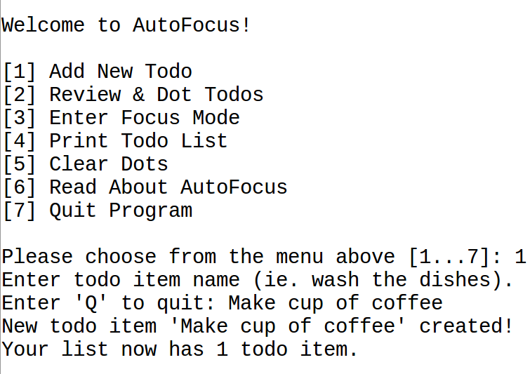

# AutoFocus: A Todo-List App

  

  

Hi, we're building a todo list app! This project tests the limits of remote team-work[[1]](#first) and to-do lists[[2]](#second). You can [get paid](https://github.com/avidrucker/autofocus-exp/blob/master/docs/compensation_rules.md) to work on this project. Click on a role below to learn more about how you can help. To see this project's current status and roadmap, [click here](https://github.com/avidrucker/autofocus-exp/blob/master/docs/roadmap.md).

## Please help us :sos::wave:

I'm interested to contribute as a...

### [designer](https://github.com/avidrucker/autofocus-exp/blob/master/docs/designer_readme.md) :paintbrush::art:

### [writer/editor](https://github.com/avidrucker/autofocus-exp/blob/master/docs/writer_readme.md) :pencil::bookmark_tabs:

### [programmer](https://github.com/avidrucker/autofocus-exp/blob/master/docs/dev_readme.md) :computer::keyboard:

### [data scientist](https://github.com/avidrucker/autofocus-exp/blob/master/docs/scientist_readme.md) :bar_chart::chart_with_upwards_trend:

### [something else](https://github.com/avidrucker/autofocus-exp/blob/master/docs/contributor_readme.md) :rainbow::unicorn:

You can see our full list of project tasks on our [issues board](https://github.com/avidrucker/autofocus-exp/issues).

## Current Contributors :hammer_and_wrench:

- [Kyle Griffin](https://github.com/kaerudesigns) designer, researcher
- [Ethan Weibman](http://github.com/themadarchitect) software engineer 
- [Avi Drucker](https://github.com/avidrucker) software engineer, architect, manager, researcher
- Your name here ...

## Project License :page_with_curl:

[MIT](https://choosealicense.com/licenses/mit/#)

## References :electric_plug:

[1] ["eXtremely Distributed Software Development", at DevTernity](https://www.youtube.com/watch?v=7EytYc7K5JA)

[2] [Mark Forster AutoFocus Time Management System](http://markforster.squarespace.com/autofocus-system/)

